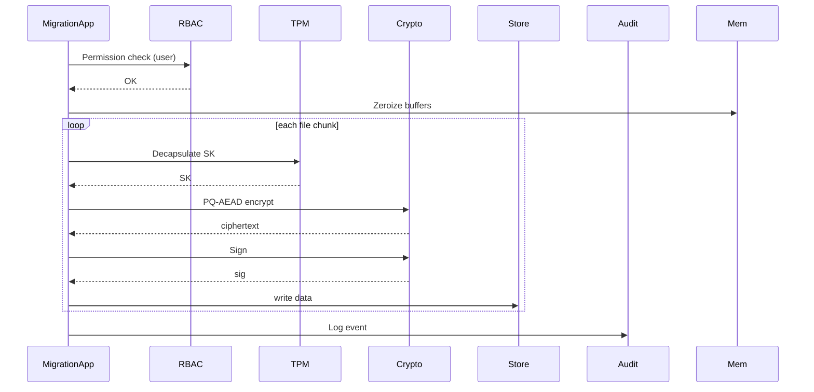
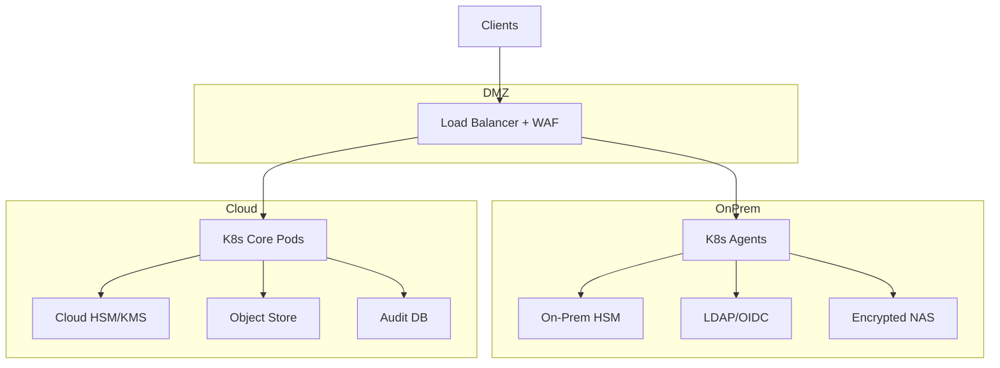
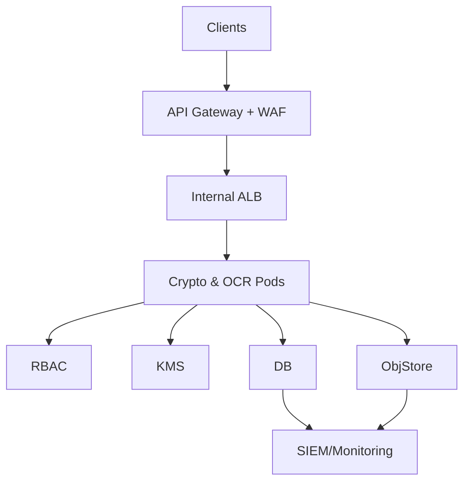

````markdown
# SNDL: Post-Quantum Secure Data Migration Framework

<!-- Load Mermaid for diagrams -->
<script src="https://cdn.jsdelivr.net/npm/mermaid@10/dist/mermaid.min.js"></script>
<script>mermaid.initialize({ startOnLoad: true });</script>

## Introduction

The **SNDL** framework addresses the “store‑now, decrypt‑later” threat from future quantum computers capable of breaking classical ciphers. It migrates entire datastores to **post-quantum cryptography** using:

- **CRYSTALS‑Kyber** (KEM) for hybrid key encapsulation
- **CRYSTALS‑Dilithium** for digital signatures
- **PQ‑AEAD** (e.g. Ascon‑128a) for payload encryption

A **Tesseract‑based OCR** pipeline classifies scanned documents by sensitivity. **RBAC** at the API layer binds every operation to a user ID. Every encrypt/decrypt/policy event appends an HMAC‑protected **Merkle‑tree** log for tamper‑evident audit trails. Containerized microservices (REST/gRPC, Web UI) run on Kubernetes with LDAP/OIDC SSO, on‑prem or cloud HSM, encrypted object storage, and managed audit DBs.

This open‑source design aligns with **OpenSSF best practices** (Scorecard checks, Sigstore signing, governance) for secure, community‑driven adoption.

---

## 4+1 View Architecture

### 1. Scenarios (Use Case View)

```mermaid
flowchart TB
  UC1["UC1: Mass Data Migration"] -->|Admin| UC2["UC2: On‑Demand File Access"]
  UC3["UC3: OCR‑Driven Classification & Store"]
  UC4["UC4: RBAC Policy Management"]
  UC5["UC5: Audit & Compliance"]
  UC6["UC6: Key Rotation & Revocation"]
````

### 2. Logical View

```mermaid
flowchart TB
  subgraph API
    REST["REST Endpoints"]
    gRPC["gRPC Services"]
    CLI["CLI Tool"]
    UI["Web Dashboard"]
  end
  subgraph Core
    PQC["PQC Engine (Kyber, Dilithium, PQ‑AEAD)"]
    RBAC["RBAC Service"]
    OCR["OCR Processor"]
    Audit["Audit Module (Merkle‑Tree)"]
  end
  subgraph Integrations
    LDAP["LDAP/OIDC"]
    TPM["HSM/TPM"]
    Store["Storage Adapters"]
  end
  API --> Core --> Integrations
```

### 3. Development View

```
/src
 ├─ core/
 ├─ api/
 ├─ cli/
 ├─ web/
 ├─ integration/
 └─ tests/
```

### 4. Process View



### 5. Physical View

#### Hybrid On‑Prem + Cloud



#### Fully‑Cloud (Zero‑Trust)



```
```
