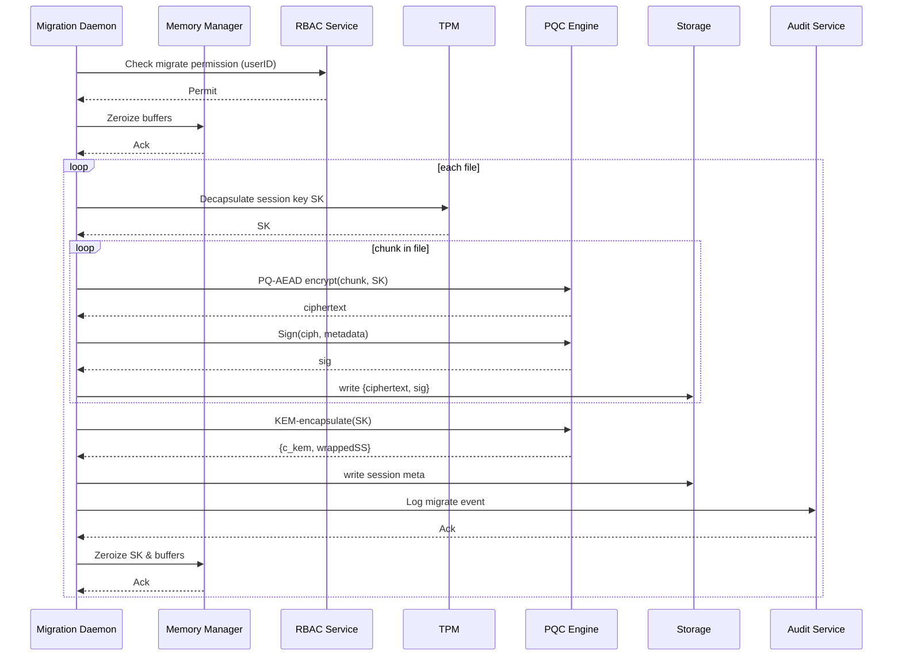
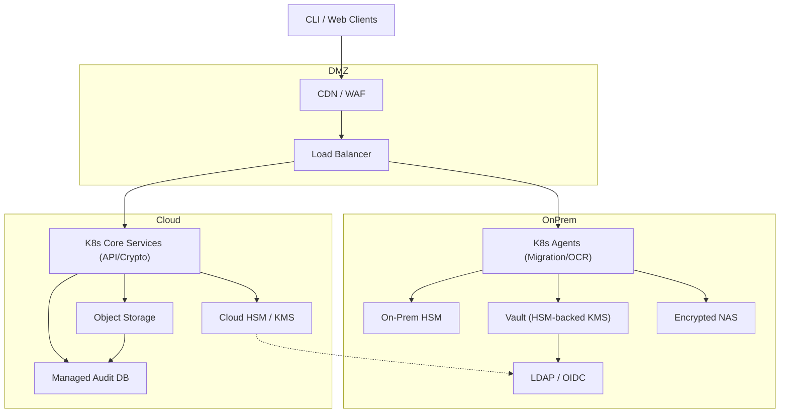
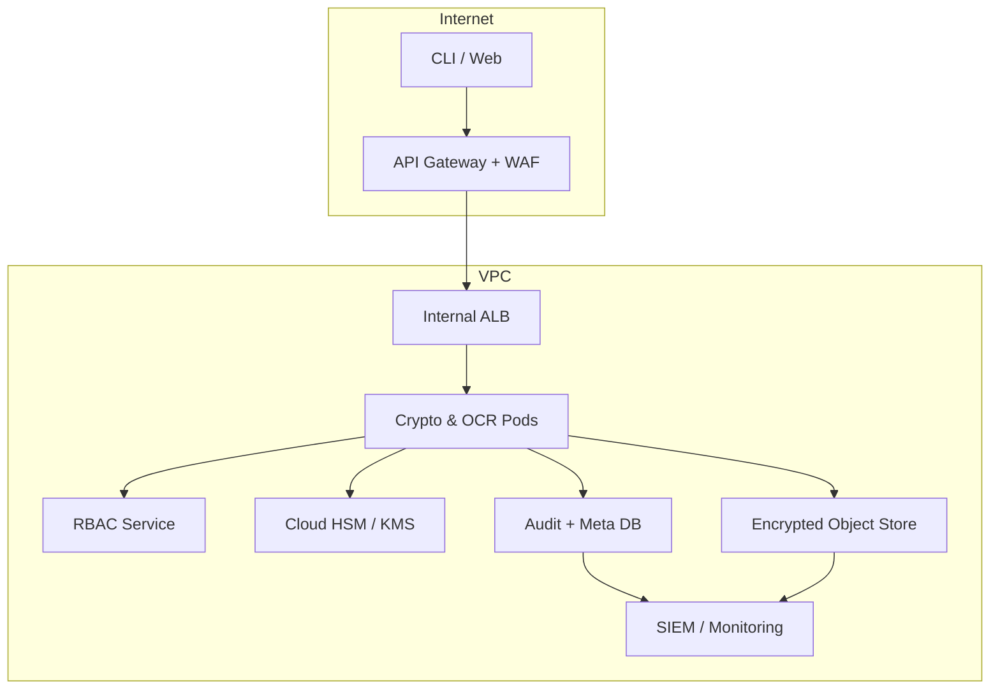
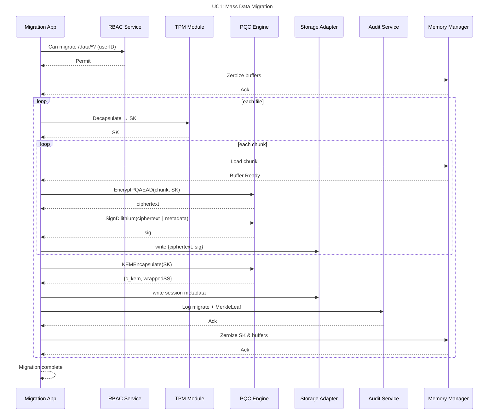
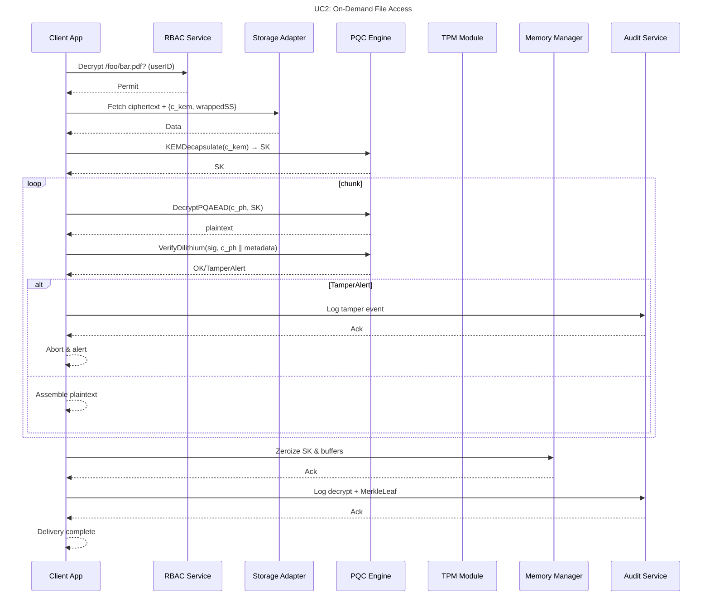
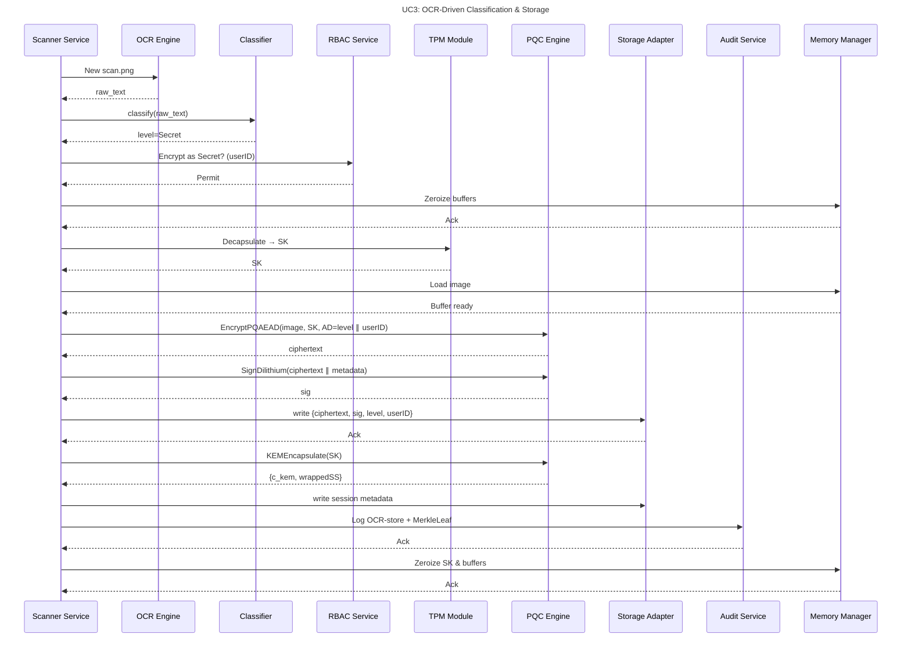
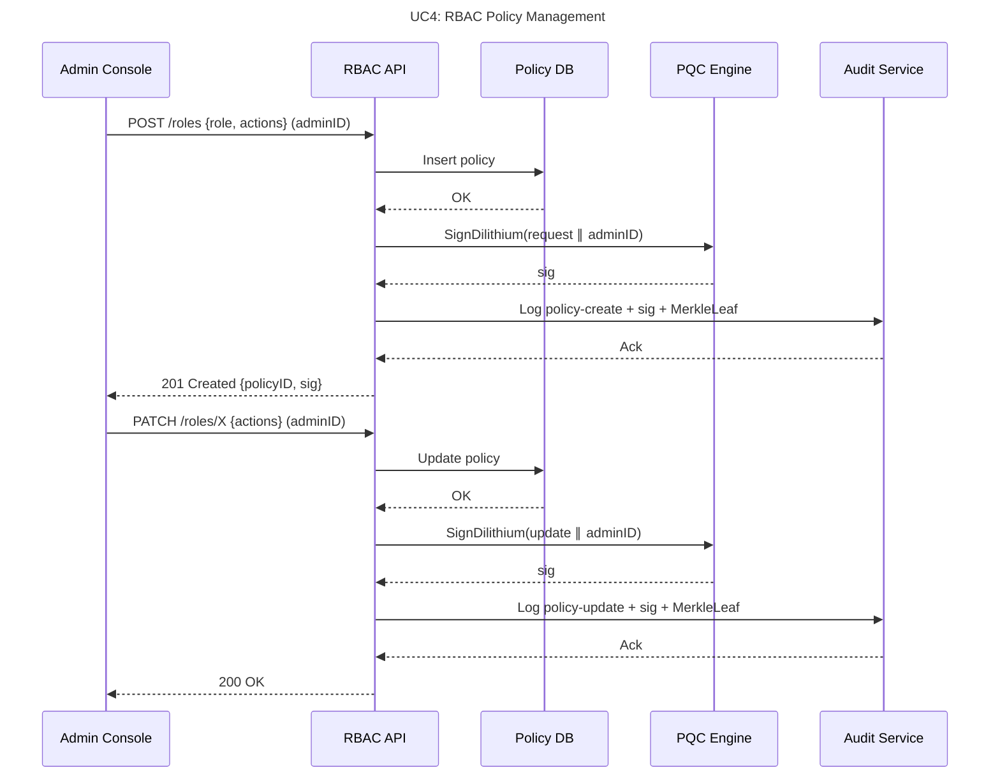
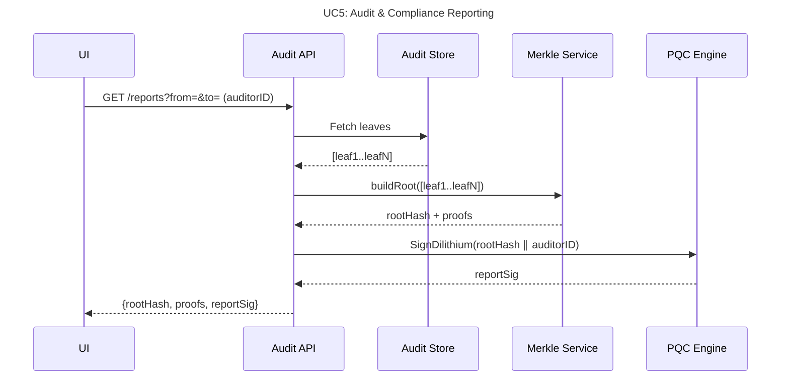
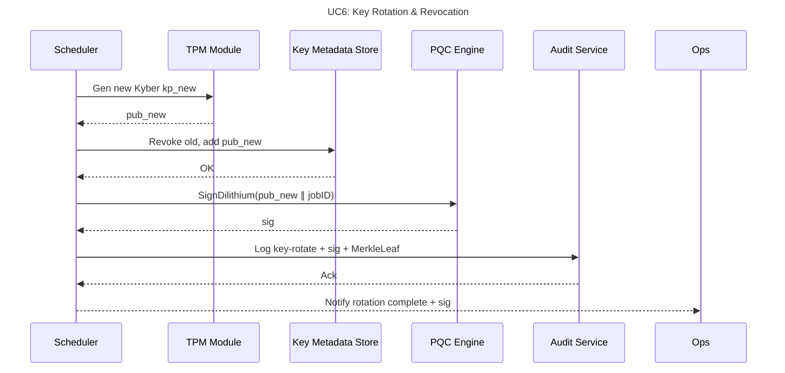

# SNDL: Post-Quantum Secure Data Migration Framework

## Introduction

The SNDL framework addresses the critical “store‑now, decrypt‑later” threat posed by emergent quantum computers that can retroactively break classical encryption. By migrating entire datastores and file‑systems to **quantum‑safe cryptography**, SNDL ensures confidentiality, integrity, and accountability of both live and archived data.

Key features:

* **Post‑Quantum Primitives**: NIST‑standard CRYSTALS‑Kyber (KEM) for key encapsulation, CRYSTALS‑Dilithium for digital signatures, and a lightweight PQ‑AEAD cipher (e.g. Ascon‑128a) for payload encryption.
* **OCR‑Driven Classification**: Tesseract‑based pipeline to extract and classify text from scanned documents before encryption.
* **Role‑Based Access Control (RBAC)**: Fine‑grained policies at the API layer bind every operation to a user identity.
* **Tamper‑Evident Audit Trail**: HMAC‑protected, Merkle‑tree–backed logs record each encrypt/decrypt/policy event as an append‑only proof.
* **Modular, Cloud‑Native Architecture**: Containerized microservices (REST/gRPC + Web UI), orchestrated on Kubernetes with LDAP/OIDC SSO, on‑prem or cloud HSM, encrypted object storage, and managed audit databases.

This open‑source design aligns with OpenSSF best practices—Scorecard checks, Sigstore signing, and clear governance—to enable community review, contribution, and rapid adoption.

---

## 4+1 View Architecture

### 1. Scenarios (Use Case View)

| ID  | Name                              | Actors                  | Description                                                      |
| --- | --------------------------------- | ----------------------- | ---------------------------------------------------------------- |
| UC1 | Mass Data Migration               | Migration App, Admin    | In‑place, chunked encryption of entire filesystems/databases.    |
| UC2 | On‑Demand File Access             | Client App, User        | Decrypt individual files under RBAC policies, with tamper check. |
| UC3 | OCR‑Driven Classification & Store | Scanner Service, Carols | Scan, classify, and encrypt images/docs as per sensitivity.      |
| UC4 | RBAC Policy Management            | Security Admin          | Create/update roles and permissions with auditable actions.      |
| UC5 | Audit & Compliance Reporting      | Auditor UI              | Generate Merkle‑rooted proofs and signed reports.                |
| UC6 | Key Rotation & Revocation         | Scheduler, TPM, Ops     | Rotate Kyber keys, revoke old keys, and log events securely.     |

---

### 2. Logical View

```mermaid
flowchart TB
    subgraph API Layer
      REST["REST Endpoints"]
      gRPC["gRPC Services"]
      CLI["CLI Tool"]
      UI["Web Dashboard"]
    end
    subgraph Core Engine
      PQC["PQC Crypto (Kyber, Dilithium, PQ-AEAD)"]
      RBAC["RBAC Service"]
      OCR["OCR Processor"]
      Audit["Audit Module (Merkle Tree)"]
    end
    subgraph Integration
      LDAP["LDAP/OIDC"]
      HSM["HSM / TPM"]
      Store["Storage Adapters\n(S3, FS, DB)"]
    end
    API Layer --> Core Engine
    Core Engine --> Integration
```

---

### 3. Development View (Module Structure)

```
/src
 ├─ core/
 │   ├─ crypto/    # Kyber KEM, Dilithium, PQ-AEAD wrappers
 │   ├─ rbac/      # Policy engine, storage, evaluation
 │   ├─ ocr/       # Tesseract bindings, classifiers
 │   └─ audit/     # Merkle-tree, log writers, HMAC
 ├─ api/
 │   ├─ rest/      # Controllers, DTOs, routers
 │   └─ grpc/      # .proto definitions, server impl
 ├─ cli/          # Command-line tool
 ├─ web/          # React or Vue dashboard
 ├─ integration/  # LDAP/OIDC, HSM drivers, store adapters
 ├─ tests/        # Unit, integration, fuzz tests
 └─ docs/         # HLD, user guide, OpenSSF playbook
```

---

### 4. Process View



---

### 5. Physical View

#### 5.1 Hybrid On‑Prem + Cloud



#### 5.2 Fully‑Cloud (Zero‑Trust)



---

## Sequence Diagrams (Detailed Operations)

#### UC1: Mass Data Migration



#### UC2: On‑Demand File Access



#### UC3: OCR‑Driven Classification & Storage



#### UC4: RBAC Policy Management



#### UC5: Audit & Compliance Reporting



#### UC6: Key Rotation & Revocation


