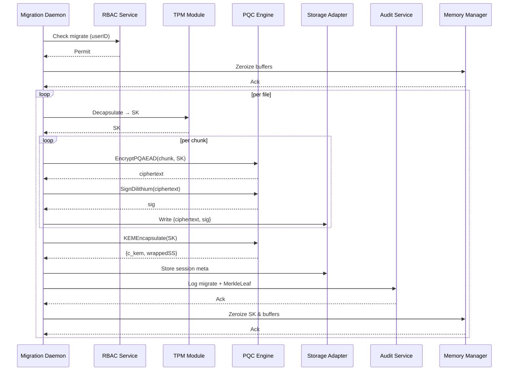
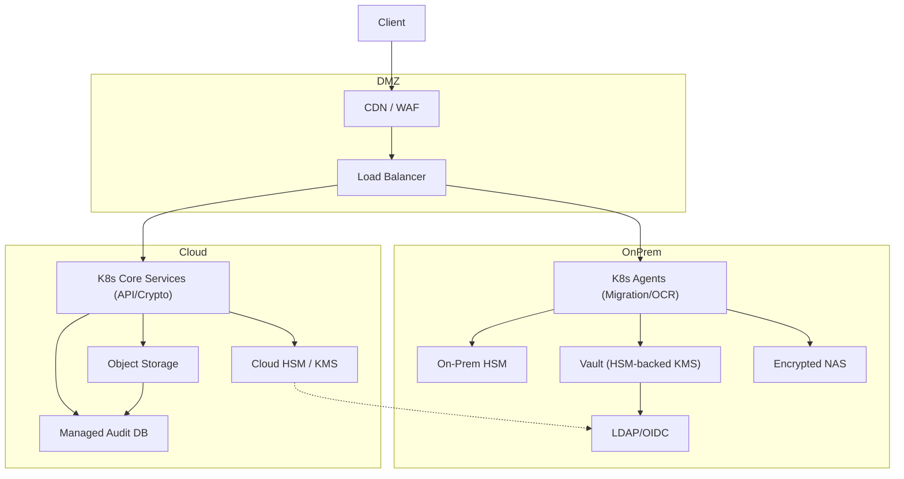

# SNDL: Post-Quantum Secure Data Migration Framework

## Introduction

The SNDL framework remediates the “store-now, decrypt-later” threat posed by emergent quantum computers capable of breaking classical encryption. By migrating entire datastores and file systems to **quantum-safe** cryptography, SNDL ensures confidentiality, integrity, and accountability of both active and archived data.

Key features:

* **Post-Quantum Primitives**: NIST-standard CRYSTALS-Kyber (KEM) for key encapsulation, CRYSTALS-Dilithium for digital signatures, and a lightweight PQ-AEAD cipher (e.g., Ascon-128a) for payload encryption.
* **OCR-Driven Classification**: Tesseract-based pipeline to extract and classify text from scanned documents.
* **Role-Based Access Control (RBAC)**: Fine-grained policies at the API layer bind every operation to a user identity.
* **Tamper-Evident Audit Trail**: HMAC-protected, Merkle-tree–backed logs record each encrypt, decrypt, and policy-change event.
* **Modular, Cloud-Native**: Containerized microservices (REST/gRPC + Web UI), orchestrated on Kubernetes with LDAP/OIDC SSO, HSM integration, and encrypted object storage.

Aligns with OpenSSF best practices—Scorecard checks, Sigstore signing, and clear governance—to enable community review and rapid adoption.

---

## 4+1 View Architecture

### 1. Scenarios (Use Case View)

| ID  | Name                              | Actors               | Description                                                |
| --- | --------------------------------- | -------------------- | ---------------------------------------------------------- |
| UC1 | Mass Data Migration               | Migration App, Admin | Chunked encryption of full filesystems/databases in-place. |
| UC2 | On-Demand File Access             | Client App, User     | Decrypt and verify individual files under RBAC policies.   |
| UC3 | OCR-Driven Classification & Store | Scanner Service      | Classify and encrypt scanned docs by sensitivity level.    |
| UC4 | RBAC Policy Management            | Security Admin       | Create/update roles and permissions with audit logging.    |
| UC5 | Audit & Compliance Reporting      | Auditor UI           | Generate Merkle-rooted proofs and signed reports.          |
| UC6 | Key Rotation & Revocation         | Scheduler, TPM, Ops  | Rotate PQ keys, revoke old keys, and log events securely.  |

---

### 2. Logical View

```mermaid
flowchart TB
  subgraph API Layer
    REST["REST Endpoints"]
    gRPC["gRPC Services"]
    CLI["CLI Tool"]
    UI["Web Dashboard"]
  end

  subgraph Core Engine
    PQC["PQC Crypto (Kyber, Dilithium, PQ-AEAD)"]
    RBAC["RBAC Service"]
    OCR["OCR Processor"]
    Audit["Audit Module (Merkle Tree)"]
  end

  subgraph Integration
    LDAP["LDAP / OIDC"]
    HSM["HSM / TPM"]
    Store["Storage Adapters (S3, FS, DB)"]
  end

  API Layer --> Core Engine
  Core Engine --> Integration
```

<details>
<summary>ASCII Fallback</summary>

```
    REST, gRPC, CLI, UI  
          |             
    -----------------   
       Core Engine      
    [PQC|RBAC|OCR|Audit]
          |             
   -------------------  
     Integration Layer  
[LDAP | HSM | Storage] 
```

</details>

---

### 3. Development View (Module Structure)

```
/src
 ├─ core/
 │   ├─ crypto/    # Kyber KEM, Dilithium, PQ-AEAD wrappers
 │   ├─ rbac/      # Policy engine
 │   ├─ ocr/       # Tesseract bindings
 │   └─ audit/     # Merkle-tree, log writers
 ├─ api/
 │   ├─ rest/      # Controllers, DTOs
 │   └─ grpc/      # .proto, servers
 ├─ cli/          # Command‑line tool
 ├─ web/          # React/Vue dashboard
 ├─ integration/  # LDAP/OIDC, HSM, store adapters
 └─ tests/        # Unit, integration, fuzz tests
```

---

### 4. Process View



<details>
<summary>ASCII Fallback</summary>

```
Mig → RB → Permit
Mig → Me → Ack
for each file:
  Mig → TP → SK
  for each chunk:
    Mig → PQ → CT
    Mig → PQ → Sig
    Mig → St → store
  Mig → PQ → {c_kem, wrappedSS}
  Mig → St → meta
  Mig → Au → log
  Mig → Me → cleanup
```

</details>

---

### 5. Physical View

#### 5.1 Hybrid On-Prem + Cloud



<details>
<summary>ASCII Fallback</summary>

```
Client
  ↓
CDN / WAF → LB
  ↓        ↙  ↘
K8sOn   K8sCloud  
 | HSMOn   | KMS   
 | Vault   | Store 
 | NAS     | DB    
LDAP ← Vault & KMS
Store → DB
```

</details>

#### 5.2 Fully-Cloud (Zero-Trust)

```mermaid
flowchart TB
  subgraph Internet
    Clients["CLI / Web"]
    GW["API Gateway / WAF"]
  end

  subgraph VPC
    ALB["Internal ALB"]
    Pods["Crypto & OCR Pods"]
    RBACSvc["RBAC Service"]
    KMS["Cloud HSM / KMS"]
    ObjStore["Encrypted Object Store"]
    DB["Audit & Meta DB"]
    SIEM["SIEM / Monitoring"]
  end

  Clients→GW→ALB→Pods
  Pods→RBACSvc & KMS & ObjStore & DB
  DB→SIEM
  ObjStore→SIEM
```

<details>
<summary>ASCII Fallback</summary>

```
Internet: Clients → API GW/WAF → ALB
ALB → Pods
Pods → RBACSvc, KMS, ObjStore, DB
DB → SIEM
ObjStore → SIEM
```

</details>

---

## Sequence Diagrams (Detailed Operations)

The sequence flows for UC1–UC6 are included in the main design file under **Sequence Diagrams**. These embed both Mermaid and ASCII representations to ensure readability.
